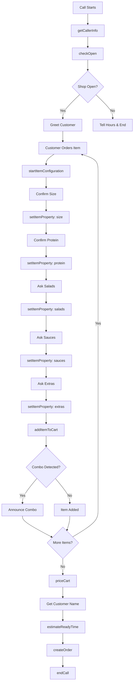

# 🍽️ Kebabalab VAPI Phone Ordering System

**Enterprise-grade automated phone ordering system with intelligent combo detection**

## 🌟 Features

- ✅ **Step-by-step order configuration** - Systematically confirms size, protein, salads, sauces for each item
- ✅ **Automatic combo detection** - Intelligently converts orders to combos/meals for best pricing
- ✅ **No default assumptions** - Always asks for toppings explicitly (no surprise ingredients!)
- ✅ **Smart pricing** - Handles combos, extras, and modifications correctly
- ✅ **Production-ready** - Enterprise logging, error handling, and state management
- ✅ **Australian localized** - AU phone numbers, timezone, pricing (AUD)

## 📋 System Architecture

```
┌─────────────┐
│   Customer  │ (Phone Call)
│    Calls    │
└──────┬──────┘
       │
       ▼
┌─────────────────┐
│  VAPI Platform  │ (Voice AI)
│   Assistant     │
└──────┬──────────┘
       │ (Webhook)
       ▼
┌─────────────────┐
│  Server (v2)    │ ◄── This System
│  FastAPI App    │
└──────┬──────────┘
       │
       ▼
┌─────────────────┐
│ SQLite Database │
│  (orders.db)    │
└─────────────────┘
```

## 🚀 Quick Start

### 1. Install Dependencies

```bash
pip install -r requirements.txt
```

### 2. Configure Environment

```bash
cp .env.example .env
# Edit .env with your settings
```

### 3. Start Server

```bash
python server_v2.py
```

Server runs on `http://localhost:8000`

### 4. Expose Server (Development)

```bash
ngrok http 8000
```

Note the HTTPS URL (e.g., `https://abc123.ngrok-free.app`)

### 5. Configure VAPI

1. Create assistant in VAPI dashboard
2. Copy system prompt from `system-prompt.md`
3. Create tools using `vapi-tools-definitions.json`
4. Update webhook URLs to your server
5. Test!

See **[DEPLOYMENT_GUIDE.md](DEPLOYMENT_GUIDE.md)** for complete setup instructions.

## 📁 File Structure

```
kebabalab-vapi/
├── server_v2.py                    # Main FastAPI server with state machine
├── system-prompt.md                # Complete VAPI assistant prompt
├── vapi-tools-definitions.json     # Tool schemas for VAPI
├── menu.json                       # Menu with combo definitions
├── business.json                   # Business details
├── hours.json                      # Operating hours
├── rules.json                      # Business rules (optional)
├── requirements.txt                # Python dependencies
├── .env.example                    # Environment template
├── DEPLOYMENT_GUIDE.md             # Full deployment instructions
├── TESTING_SCENARIOS.md            # Test scenarios
└── README.md                       # This file
```

## 🔧 How It Works

### Order Flow



### Combo Detection

The system automatically detects these combos:

| Items | Combo Name | Price | Savings |
|-------|-----------|-------|---------|
| Small Kebab + Can | Small Kebab & Can Combo | $12 | $1.50 |
| Large Kebab + Can | Large Kebab & Can Combo | $17 | $1.50 |
| Small Kebab + Small Chips + Can | Small Kebab Meal | $17 | $1.50 |
| Large Kebab + Small Chips + Can | Large Kebab Meal | $22 | $1.50 |
| Large Kebab + Large Chips + Can | Large Kebab Meal (Large Chips) | $25 | $2.50 |
| Small HSP + Can | Small HSP Combo | $17 | $1.50 |
| Large HSP + Can | Large HSP Combo | $22 | $1.50 |

**Note:** HSPs already include chips, so no HSP+Chips combos exist.

## 🎯 Key Features Explained

### 1. State Machine Architecture

Each order uses a state machine that tracks:
- Current item being configured
- What's been confirmed (size, protein, salads, etc.)
- What still needs confirmation
- Cart state

### 2. No Default Assumptions

Unlike typical systems, this **never assumes** what customer wants:
- ❌ Don't assume "lettuce, tomato, onion"
- ❌ Don't assume "garlic sauce"
- ✅ Always ask explicitly

### 3. Intelligent Combo Detection

When items are added to cart, system checks if they form a combo:
- Kebab + Can → Kebab Combo
- Kebab + Chips + Can → Kebab Meal
- HSP + Can → HSP Combo

Announces naturally: *"I've made that a Small Kebab Meal for you!"*

### 4. Salt Handling

- **Default:** Chicken salt (unless customer specifies)
- Only ask about salt if customer mentions it
- Options: chicken, normal, none

## 🧪 Testing

See **[TESTING_SCENARIOS.md](TESTING_SCENARIOS.md)** for comprehensive test cases.

Quick test:
```bash
curl -X POST http://localhost:8000/webhook \
  -H "Content-Type: application/json" \
  -d '{
    "message": {
      "toolCalls": [{
        "function": {"name": "checkOpen", "arguments": "{}"},
        "id": "test123"
      }]
    }
  }'
```

## 📊 Database Schema

```sql
CREATE TABLE orders (
    id INTEGER PRIMARY KEY AUTOINCREMENT,
    order_id TEXT UNIQUE NOT NULL,
    created_at TEXT NOT NULL,
    ready_at TEXT,
    customer_name TEXT,
    customer_phone TEXT NOT NULL,
    order_type TEXT DEFAULT 'pickup',
    delivery_address TEXT,
    cart TEXT NOT NULL,           -- JSON
    totals TEXT NOT NULL,         -- JSON
    status TEXT DEFAULT 'pending',
    notes TEXT
);
```

View orders:
```bash
sqlite3 orders.db "SELECT * FROM orders ORDER BY created_at DESC LIMIT 5;"
```

## 🔐 Environment Variables

| Variable | Description | Example |
|----------|-------------|---------|
| `DB_PATH` | Database file path | `orders.db` |
| `GST_RATE` | Australian GST rate | `0.10` |
| `SHOP_TIMEZONE` | Timezone | `Australia/Melbourne` |
| `TWILIO_ACCOUNT_SID` | Twilio SID (optional) | `ACxxxxx` |
| `TWILIO_AUTH_TOKEN` | Twilio token (optional) | `xxxxx` |

## 🛠️ Tools Available

| Tool | Purpose | Parameters |
|------|---------|------------|
| `checkOpen` | Check if shop is open | None |
| `getCallerInfo` | Get caller's phone number | None |
| `startItemConfiguration` | Start configuring item | `category`, `name` |
| `setItemProperty` | Set item property | `field`, `value` |
| `addItemToCart` | Add configured item to cart | None |
| `getCartState` | Get current cart | None |
| `priceCart` | Calculate total price | None |
| `estimateReadyTime` | Estimate ready time | `requestedTime` |
| `createOrder` | Create final order | `customerName`, `customerPhone`, `readyAtIso` |
| `endCall` | End the call | None |

## 📞 Example Order

**Customer:** "I'll get a small chicken kebab please."

**System Flow:**
```javascript
startItemConfiguration({ category: "kebabs", name: "Chicken Kebab" })
setItemProperty({ field: "size", value: "small" })
setItemProperty({ field: "protein", value: "chicken" })
// Ask: "What salads would you like?"
setItemProperty({ field: "salads", value: ["lettuce", "tomato", "onion"] })
// Ask: "And which sauces?"
setItemProperty({ field: "sauces", value: ["garlic", "chilli"] })
// Ask: "Any extras?"
setItemProperty({ field: "extras", value: [] })
addItemToCart({})
```

## 🚨 Troubleshooting

### Tool calls not working
- Check webhook URL is accessible
- Verify server is running: `curl http://localhost:8000/health`
- Check server logs: `tail -f kebabalab_server.log`

### Combos not detecting
- Verify items have correct `category` and `size`
- Check `detect_combo_opportunity` logs
- Use `getCartState` to inspect cart

### Orders not saving
- Check database permissions
- Verify `DB_PATH` in .env
- Check schema: `sqlite3 orders.db ".schema"`

## 📚 Documentation

- **[DEPLOYMENT_GUIDE.md](DEPLOYMENT_GUIDE.md)** - Complete deployment instructions
- **[TESTING_SCENARIOS.md](TESTING_SCENARIOS.md)** - Test scenarios and validation
- **[system-prompt.md](system-prompt.md)** - VAPI assistant prompt

## 🎯 Production Checklist

- [ ] Server deployed to production
- [ ] HTTPS configured
- [ ] Environment variables set
- [ ] Database backups configured
- [ ] VAPI assistant configured
- [ ] All tools created and attached
- [ ] System prompt uploaded
- [ ] Test orders completed
- [ ] Monitoring set up
- [ ] Phone number configured

## 📈 Monitoring

### Health Check
```bash
curl https://your-domain.com/health
```

### View Logs
```bash
tail -f kebabalab_server.log
```

### Check Recent Orders
```bash
sqlite3 orders.db "SELECT order_id, customer_name, created_at FROM orders ORDER BY created_at DESC LIMIT 10;"
```

## 🤝 Support

For issues or questions:
1. Check logs for errors
2. Review TESTING_SCENARIOS.md
3. Verify VAPI configuration
4. Test tools individually

## 📝 License

Proprietary - Kebabalab St Kilda

---

**Built with ❤️ for Kebabalab St Kilda** 🥙

*Enterprise-grade phone ordering that just works.*
